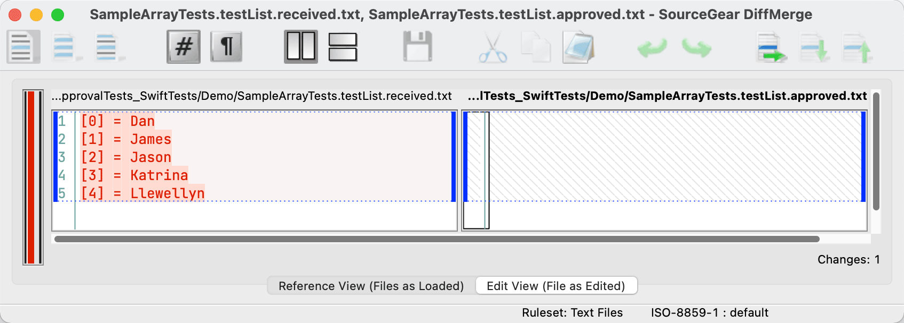
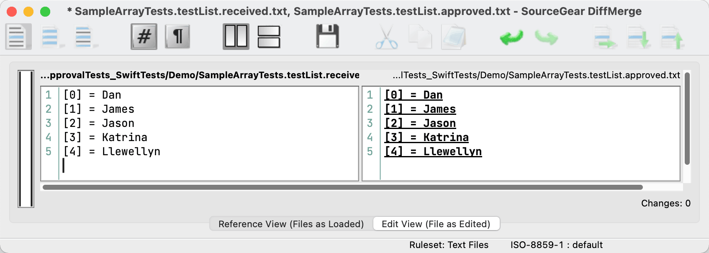

#  ApprovalTests

[](https://github.com/approvals/ApprovalTests.Swift/actions/workflows/build.yml)
[](https://swiftpackageindex.com/approvals/ApprovalTests.Swift)
[](https://swiftpackageindex.com/approvals/ApprovalTests.Swift)
[](https://github.com/Carthage/Carthage)

Approval Tests are an alternative to assertions. You’ll find them useful for testing objects with complex values (such as long strings), lots of properties, or collections of objects.

ApprovalTests.Swift is compatible with the XCTest testing framework.

<!-- toc -->
## Contents

  * [My First Approval Test](#my-first-approval-test)
  * [Predefined Verifiers](#predefined-verifiers)
  * [How to Use with iOS](#how-to-use-with-ios)
  * [Which File Artifacts to Exclude from Source Control](#which-file-artifacts-to-exclude-from-source-control)
  * [How to Get It](#how-to-get-it)
    * [Swift Package Manager](#swift-package-manager)
    * [Carthage](#carthage)
    * [macOS Starter Project](#macos-starter-project)
  * [For More Information](#for-more-information)
    * [Questions?](#questions)
    * [Video Tutorials](#video-tutorials)
    * [Documentation](#documentation)
    * [Podcasts](#podcasts)<!-- endToc -->


## My First Approval Test

We'll start by writing a simple unit test to verify a list of names. But instead of using XCTest's `XCTAssertEqual` function, we'll use `Approvals.verifyAll`:

<!-- snippet: sample_test -->
<a id='snippet-sample_test'></a>
```swift
class SampleArrayTests: XCTestCase {

    func testList() throws {
        var names = ["Llewellyn", "James", "Dan", "Jason", "Katrina"]
        names.sort()
        try Approvals.verifyAll(names)
    }
```
<sup><a href='/ApprovalTests_SwiftTests/Demo/SampleArrayTests.swift#L8-L16' title='Snippet source file'>snippet source</a> | <a href='#snippet-sample_test' title='Start of snippet'>anchor</a></sup>
<!-- endSnippet -->

The `verifyAll()` function performs a test assertion for a list of items. Unlike a normal assertion, it doesn’t specify an expected list. Instead, this will produce a “received” file matching the name of your test suite and test case. In this example, it will write a file `SampleArrayTests.testList.received.txt`:

<!-- snippet: SampleArrayTests.testList.approved.txt -->
<a id='snippet-SampleArrayTests.testList.approved.txt'></a>
```txt
[0] = Dan
[1] = James
[2] = Jason
[3] = Katrina
[4] = Llewellyn
```
<sup><a href='/ApprovalTests_SwiftTests/Demo/SampleArrayTests.testList.approved.txt#L1-L5' title='Snippet source file'>snippet source</a> | <a href='#snippet-SampleArrayTests.testList.approved.txt' title='Start of snippet'>anchor</a></sup>
<!-- endSnippet -->

It also opens two files in a diff editor—the “received” file, and the “approved” file.



To approve the results, tell the diff editor to apply changes from the left side to the right side:



Most of the time, you’ll use one of the [supported diff tools](docs/reference/reporters.md#supported-diff-tools) to examine and approve the result. If you don’t have any of these diff tools, you can rename the received file to `SampleArrayTests.testList.approved.txt` and the test will now pass.


## Predefined Verifiers

ApprovalTests.Swift comes with useful verifiers:

- `Approvals.verify` — verify object or dictionary
- `Approvals.verifyAll` — verify array of items
- `Approvals.verifyAsJSON` — verify Encodable object converted to JSON
- `Approvals.verifyQuery` — verify query, also showing query results on failure
- `Approvals.verifySequence` — verify sequence of changing values


## How to Use with iOS

ApprovalTests.Swift runs out-of-the-box for macOS tests. But for iOS tests, you need a separate process running on your Mac to watch for diffs. Run [iOSApprovalsWatcher.py](https://github.com/approvals/ApprovalTests.Swift/blob/master/iOSApprovalsWatcher.py) from your command line, giving it the path to your test directory.


## Which File Artifacts to Exclude from Source Control

You must add any “approved” files to your source control system. But “received” files can change with any run and should be ignored. For Git, add `*.received.*` to your `.gitignore`.

If you have iOS tests, you should also add `command.sh` to your `.gitignore`. (They are scripts written by the iOS side for the file monitor to execute from the macOS side.)

So for iOS testing, make sure to exclude:

```
*.received.*
command.sh
```


## How to Get It

### Swift Package Manager

See an example [package manifest](https://github.com/approvals/ApprovalTests.Swift.StarterProject.MacOs/blob/main/Package.swift#L17-L22) here

Get the following dependency:

<!-- snippet: package_include_approvals -->
<a id='snippet-package_include_approvals'></a>
```swift
dependencies: [
    .package(
        name: "ApprovalTests.Swift",
        url: "https://github.com/approvals/ApprovalTests.Swift",
        from: "1.0.0"
        ),
],
```
<sup><a href='#snippet-package_include_approvals' title='Start of snippet'>anchor</a></sup>
<!-- endSnippet -->

Then add it to your test target:

<!-- snippet: package_add_test_target -->
<a id='snippet-package_add_test_target'></a>
```swift
.testTarget(
        name: "ApprovalTests.Swift.StarterProject.MacOSTests",
        dependencies: [
            "ApprovalTests.Swift.StarterProject.MacOS",
            "ApprovalTests.Swift"
        ],
```
<sup><a href='#snippet-package_add_test_target' title='Start of snippet'>anchor</a></sup>
<!-- endSnippet -->

### Carthage

Add the following to your Cartfile:

    github "approvals/ApprovalTests.Swift" ~> 1.0

Then drag the the built framework from the appropriate Carthage/Build directory into your project,
but with “Copy items into destination group’s folder” disabled.

### macOS Starter Project

The [macOS starter project](https://github.com/approvals/ApprovalTests.Swift.StarterProject.MacOs) is a quick way to set up a new project on GitHub. Just click the “Use this template” button.

It comes ready with:

- A Swift package definition adding ApprovalTests.Swift to the test target
- A suitable `.gitignore`
- A GitHub action to build and run tests
- A build status badge

## For More Information

### Questions?

Ask Llewellyn Falco [@LlewellynFalco](https://twitter.com/llewellynfalco) or Jon Reid [@qcoding](https://twitter.com/qcoding) on Twitter.

### Video Tutorials

You can watch [a series of short videos about using ApprovalTests in .Net](http://www.youtube.com/playlist?list=PL0C32F89E8BBB5368) on YouTube.

### Documentation

[Find extra documentation here](./docs/README.md).

### Podcasts

Prefer learning by listening? Then you might enjoy the following podcasts:

- [This Agile Life](http://www.thisagilelife.com/46/)
- [Hanselminutes](http://www.hanselminutes.com/360/approval-tests-with-llewellyn-falco)
- [Herding Code](http://www.developerfusion.com/media/122649/herding-code-117-llewellyn-falcon-on-approval-tests/)
- [The Watir Podcast](http://watirpodcast.com/podcast-53/)
